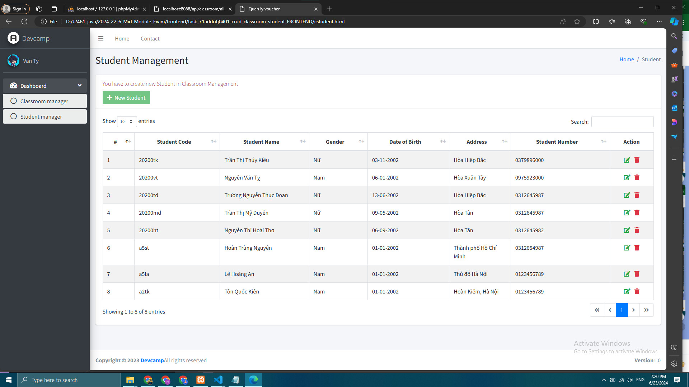

# Project CRUD Classroom-Student
# Management PROJECT CRUD for Class-Student will have 3 part

# BE
## API Reference FOR CLASSROOM
## THERE ARE:
#classroomCode
#classroomName,
#teacherName,
#teacherNumber
in the Classroom class
make the Entity with class Student 
## THERE ARE:
#studentCode
#studentName,
#gender,
#dateOfBirth
#phone
#adress
in the Student Class


## Description about the project
## Create Java Spring boost to create Database with the Entity
## Write REST API CRUD for these Models
## Make UI CRUD management CLASSROOM-STUDENT

#### Get all Classroom

```http://localhost:8088
  GET /api/classroom/all
```
#### Get Classroom by id
```http
  GET /api/classroom/detail/{id}
```
#### POST Classroom
```http://localhost:8088
  POST /api/classroom/create
```
#### PUT Classroom by id
```http
  PUT /api/classroom/update/{id}
```
#### DELETE Classroom by id
```http
  DELETE /api/classroom/delete/{id}
```

## API Reference FOR STUDENT
#### Get all student

```http://localhost:8088
  GET /api/student/all
```

#### Get student by id

```http
  GET /api/student/detail/{id}
```

#### POST student on classroomId
```http://localhost:8088
  POST /api/student/create/{classroomId}
```

#### PUT student by id

```http
  PUT /api/student/update/{id}
```

#### DELETE student by id

```http
  DELETE /api/student/delete/{id}
```

## DATABASE FOR ALL CLASSROOM INCLUDED STUDENT

+ FRONTEND *** CRUD CLASSROOM STUDENT ***





## 🧱 Technology
+ Frond-end:
: 1.Bootstrap 4
: 2.JavaScript
: 3.Jquery
: 4.AJAX
: 5.JSON
: 6.Font Awesome
: 7.DataTable

+Back-end:
: MySQLDriver
: Validation
: HipenateJPA